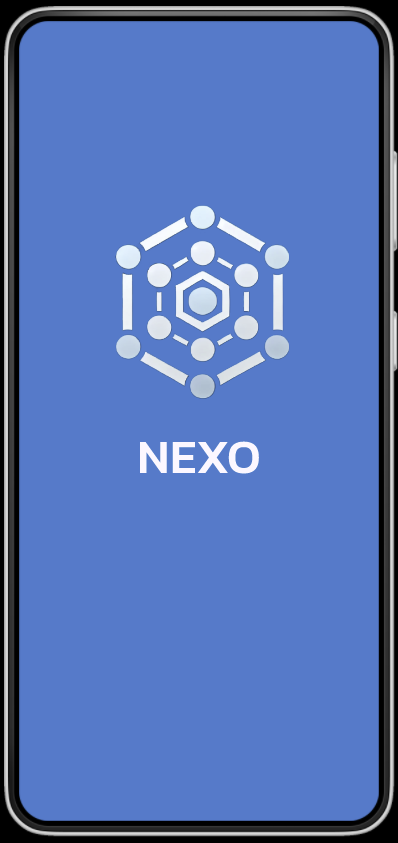
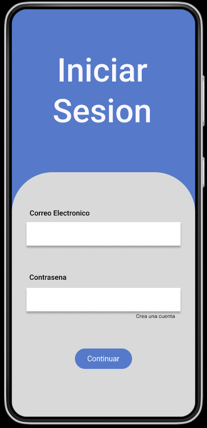
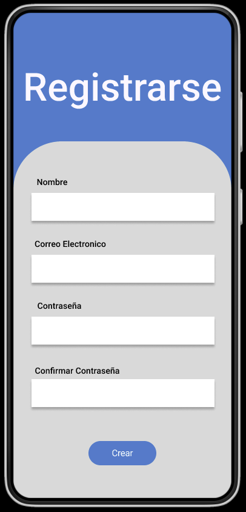
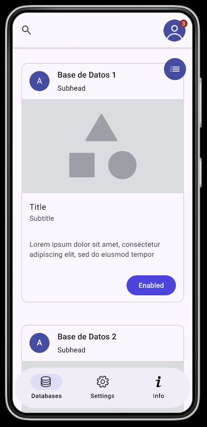
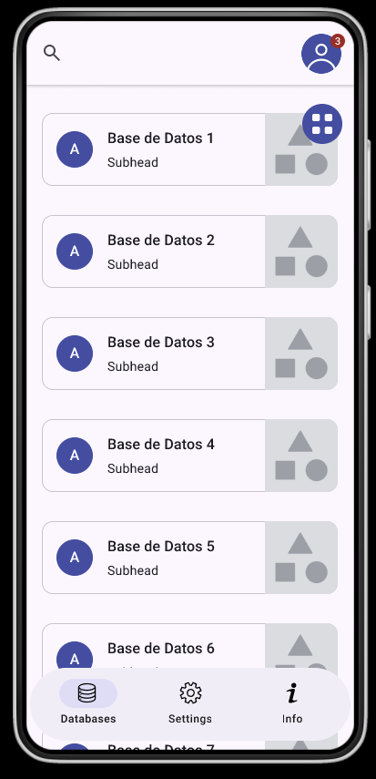
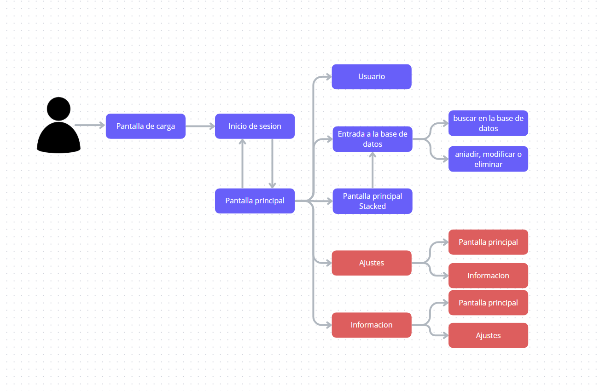

# NEXO 📱🤖

*Aplicación de Control de Bases de Datos con Inteligencia Artificial*

---

## 📋 Descripción del Proyecto

**NEXO** es un Proyecto Fin de Curso (TFG) desarrollado para el Ciclo Superior de Desarrollo de Aplicaciones Multiplataforma (DAM) en el **CES Juan Pablo II (Cádiz)** por **Rafael Álvarez Muñoz**, tutorizado por Adrián Seoane.

La aplicación permite a cualquier usuario —incluso sin conocimientos técnicos de SQL— gestionar, importar y consultar bases de datos locales (`.db`) mediante comandos escritos en **lenguaje natural**, utilizando la inteligencia artificial de OpenAI (`gpt-3.5-turbo`) para traducir las preguntas en consultas SQL ejecutables al instante.

---

## 🚀 Características Principales

* **Traducción de Lenguaje Natural a SQL:** Escribe preguntas cotidianas (ej. *"Muéstrame los productos mayores de 70"*) y la IA generará y ejecutará la sentencia SQL correspondiente.


* **Importación de Bases de Datos Local:** Capacidad de importar archivos con extensión `.db` directamente desde el dispositivo Android y gestionarlos offline.


* **Gestión de Registros:** Visualización en tarjetas interactivas (`Cards`), edición y eliminación de filas y columnas de manera intuitiva.


* **Autenticación Segura:** Sistema de inicio de sesión y registro mediante **Firebase Authentication** (Correo y Contraseña).


* **Interfaz Minimalista y Moderna:** Desarreglada íntegramente con **Jetpack Compose**, priorizando la accesibilidad y evitando la fatiga visual.


---

## 🛠️ Tecnologías Utilizadas

| Categoría | Tecnología / Librería | Descripción |
| --- | --- | --- |
| **Interfaz de Usuario** | Android Studio + Jetpack Compose

 | Desarrollo de UI moderna y reactiva. |
| **Base de Datos Local** | Room SQLite / SQLiteDatabase

 | Persistencia offline y lectura de archivos `.db`. |
| **Autenticación & Nube** | Firebase Authentication

 | Control de usuarios y sesiones privadas. |
| **Inteligencia Artificial** | OpenAI API (`gpt-3.5-turbo`)

 | Traducción de texto plano a sentencias SQL. |
| **Cliente HTTP** | OkHttp + Gson

 | Gestión de peticiones seguras a la API externa. |
| **Almacenamiento Local** | Jetpack DataStore

 | Guardado de configuraciones y credenciales. |

---

## 🎨 Diseño y Guía de Estilos

### Paleta de Colores

La aplicación utiliza una gama de tonos fríos y minimalistas diseñados para evitar el cansancio visual y ofrecer un aspecto profesional:

* **Blanco Fondo (`#FEF7FF`):** Color general de fondo de las pantallas.


* **Gris Claro (`#D9D9D9`):** Contenedores de formularios e inputs.


* **Azul Principal (`#2381CD`):** Color corporativo principal para botones y elementos destacados.


* **Azul Oscuro / Marino (`#2F55A4` / `#1C315F`):** Tonos de contraste para títulos y barras de navegación.


### Logotipo

El logotipo de NEXO representa el orden, la simetría y la estructura de los datos mediante un diseño de hexágono tecnológico, donde los vértices simbolizan entidades o registros conectados entre sí.

---

## 📐 Arquitectura y Flujo de Navegación

El proyecto sigue una arquitectura limpia basada en **MVVM (Model-View-ViewModel)**, separando la interfaz gráfica de la lógica de negocio y las fuentes de datos (Room, Firebase y OpenAI API) a través de un repositorio centralizado.

```text
[ UI (Jetpack Compose) ] 
       │
       ▼
  [ ViewModel ] 
       │
       ▼
 [ Repositorio ] ──► ( Room / Firebase / DataStore / OpenAI API )

```

## 📱 Capturas de Pantalla y Wireframes

| Pantalla de Carga | Inicio de Sesión | Registro |
| :---: | :---: | :---: |
|  |  |  |

| Pantalla Principal (Bases de Datos) | Vista Comprimida | Consultas con IA |
| :---: | :---: | :---: |
|  |  |  |

---

## ⚙️ Configuración e Instalación

1. **Clonar el repositorio** en tu equipo local.
2. Abrir el proyecto utilizando **Android Studio** (versión compatible con Gradle y Jetpack Compose).
3. Añadir el archivo de configuración de Firebase (`google-services.json`) dentro de la carpeta `/app` del proyecto.


4. Configurar tu clave privada de la API de OpenAI en el archivo `local.properties`:
```properties
OPENAI_API_KEY="tu_clave_api_aqui"

```


5. Sincronizar el proyecto con los archivos Gradle y ejecutar la aplicación en un emulador Android (API 26 o superior) o dispositivo físico.
